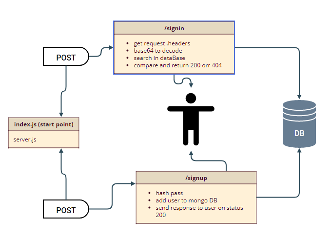
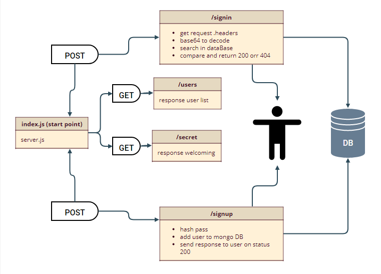

# Lab 8-401 course auth-api

## links:

- [heroku link](https://api-auth-faten.herokuapp.com/)

- [Tests link](https://github.com/Fatensamman/auth-api/actions)

- [pull request link](https://github.com/Fatensamman/auth-api/pull/2)

## End Points
#### sign up on POST 
-  https://api-auth-faten.herokuapp.com/signup/

#### sign in on POST basic auth
- https://api-auth-faten.herokuapp.com/signin/

## setup  environment

### Install
- initialization using  `npm inint -y`
- install libraries like express dotenv cors morgan bcrypt base64 mongo  jsonweptoken 
- install devDependencies like jest supertest eslint @code-fellows/supergoose
- create files tree

collaborated with raghad mustafa , and haneen alkhasawneh

 ## Documentation:
 
 basic auth
 
 
 
 
 bearer auth
 
